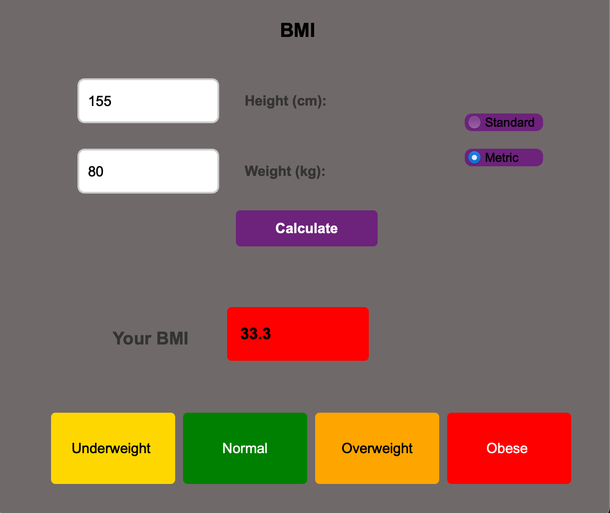
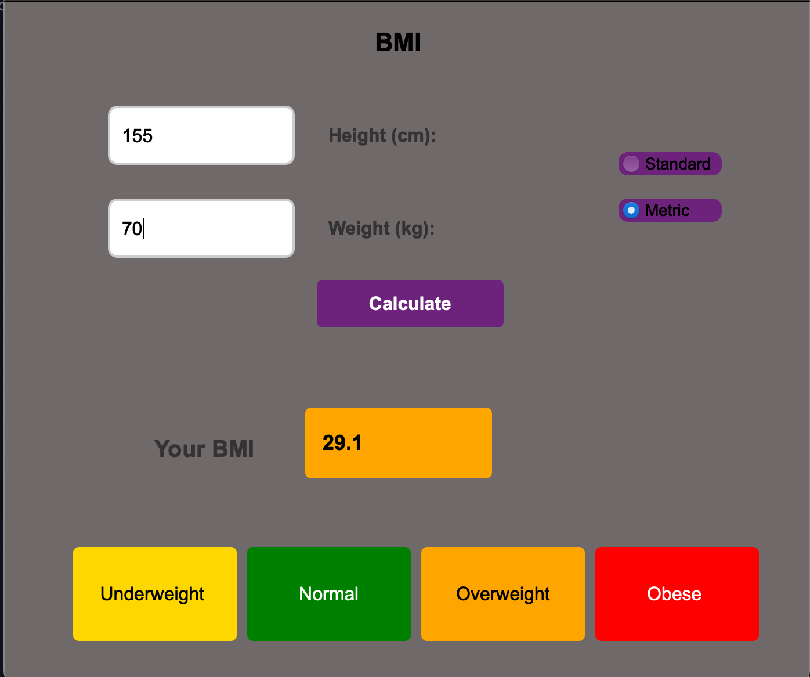
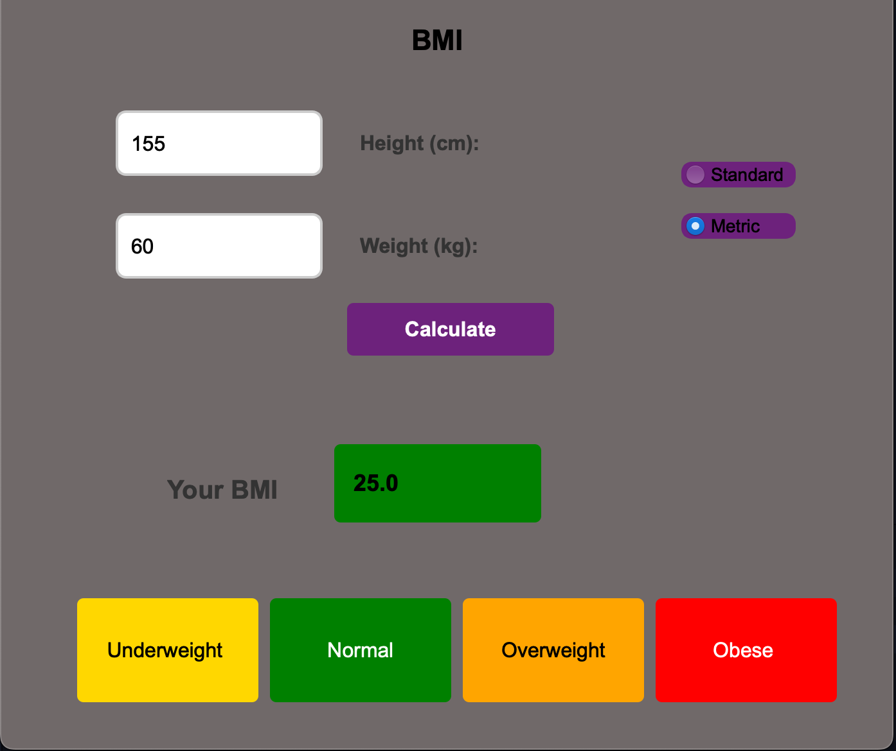
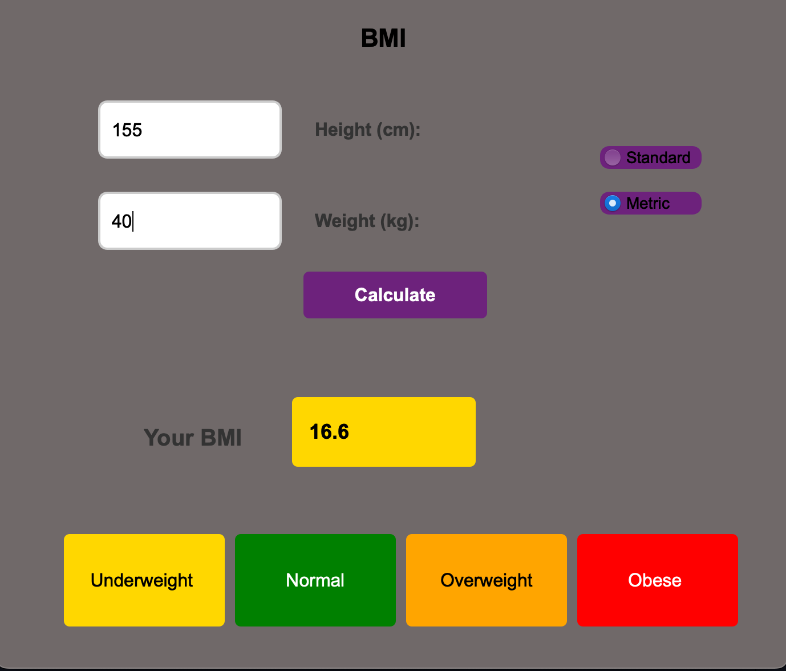

BMI Calculator

Overview:

The BMI Calculator is a PyQt-based application that allows users to calculate their Body Mass Index (BMI) based on their height and weight. 
The app also provides a BMI status classification according to the Department of Health and Human Services/National Institutes of Health guidelines.

Features:

User-friendly PyQt interface
Input fields for weight and height
Metric and Standard unit options
"Calculate BMI" button to compute the BMI
Displays BMI status (Underweight, Normal, Overweight, Obese)
Menu bar with "Exit" and "Clear" options
"Help" section explaining BMI and how to use the app

BMI Calculation Formula:

The application calculates BMI using the formula:
BMI = Weight(kg) / [Height(m)]^2 (Metric)
BMI = (Weight(lbs) * 703) / [Height(in)]^2 (Standard)

BMI Categories:

Underweight: BMI < 18.5
Normal: 18.5 ≤ BMI < 25
Overweight: 25 ≤ BMI < 30
Obese: BMI ≥ 30

How to Run the Application:

Install PyQt6 -> run main.py

Screenshots

Repository Contents:

Python source code (main.py, bmi_design.ui)
Screenshots of different inputs and outputs
README.md (this file)
